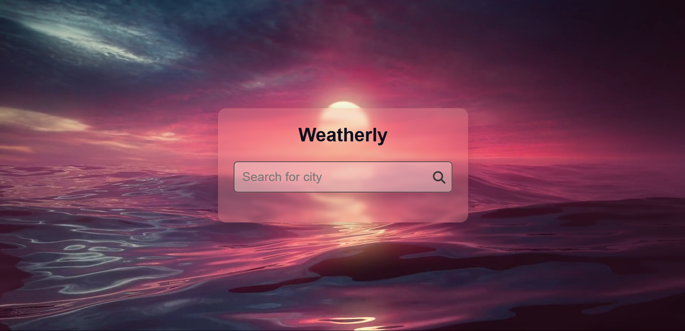

# 🌤️ Weatherly - Your Personalized Weather App

Welcome to **Weatherly**! This weather app allows you to search for any city and get up-to-date weather information at your fingertips. With a sleek design and intuitive interface, Weatherly offers quick and accurate weather data for any location worldwide.

 <!-- Add a link to a demo image or GIF here -->

---

## 🖼️ Features

- **Real-time Weather Data**: Accurate, real-time weather information for cities around the world.
- **City Autocomplete Search**: Powered by the **City API**, our smart dropdown search helps you quickly find the city you’re looking for.
- **Temperature & Humidity**: Shows both Celsius and Fahrenheit temperatures, along with humidity levels.
- **Dynamic Background Video**: Enhances the experience with a subtle, looping background video.
- **Responsive Design**: Optimized for desktop and mobile browsing.

---

## 💻 Technologies Used

- **HTML5** & **CSS3** for layout and styling
- **JavaScript** for dynamic functionality
- **WeatherAPI** for reliable weather data
- **City API** for city search and autocomplete functionality
- **Font Awesome** icons for intuitive UI elements

---

## 🚀 Getting Started

1. **Clone the repository**:
    ```bash
    git clone https://github.com/KrishPatel1010/Simple-Weather-App.git
    ```

2. **Navigate to the project folder**:
    ```bash
    cd Weatherly
    ```

3. **Open `index.html` in your favorite browser** to view the app:
    ```bash
    open index.html
    ```

---

## 🛠️ Project Structure
Weatherly/ │ ├── Assets/ # Contains background video assets │ └── Eternal Light V21080p.mp4 ├── app.js # JavaScript for fetching city & weather data ├── style.css # CSS for styling and layout ├── index.html # Main HTML structure └── README.md
---

## ⚙️ How It Works

1. **Search for a City**: Type in the name of a city to see instant dropdown suggestions, powered by the **City API**.
2. **Select a City**: Click a city from the dropdown, or use arrow keys to navigate and press enter.
3. **View Weather Data**: Get real-time weather details, including temperature, humidity, and current conditions.

---

## 🎨 Customization Tips

- **Background Video**: Replace `Assets/Eternal Light V21080p.mp4` with any high-quality MP4 file.
- **Colors & Fonts**: Adjust colors and fonts in `style.css` to match your style.
- **API Key**: Use your own WeatherAPI key in `app.js` for better rate limits.

---

## 🤝 Contributions

Feel free to fork this repository, open issues, and submit pull requests. Your feedback and contributions are welcome! 😊

---

## 📞 Contact

For questions or suggestions, reach out:

- **GitHub**: [KrishPatel1010](https://github.com/KrishPatel1010)
- **Email**: krishpatel8463@gmail.com

It's my first project so it's very basic but I will update it in future.
Thanks for checking out Weatherly! 🌈 Stay weather-aware and enjoy the app!
Believe it!!!

